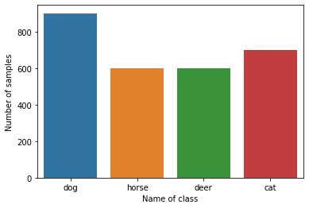
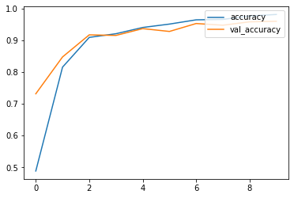
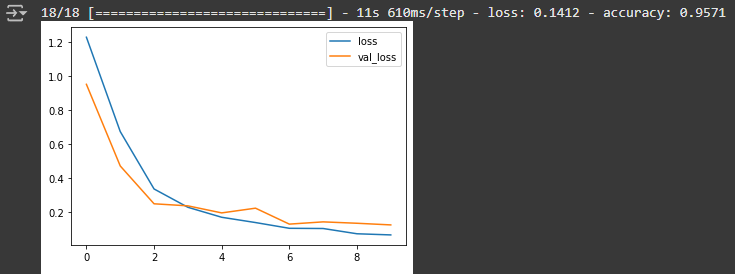

# animalclassification
This project focuses on developing a machine learning model for automatic classification of animals based on image data. By utilizing computer vision techniques, the system can recognize and classify various animal species, contributing to wildlife monitoring, conservation efforts, and academic research.
# Link Dataset
https://drive.google.com/drive/folders/1OXlNesVL24rzsCq2-trVwQeYF4AnLuNs?usp=drive_link
# Sample of Dataset

# Barplot showing the number of datasets

# Line Chart of the Training and Loss

# Line Chart and Accuracy

